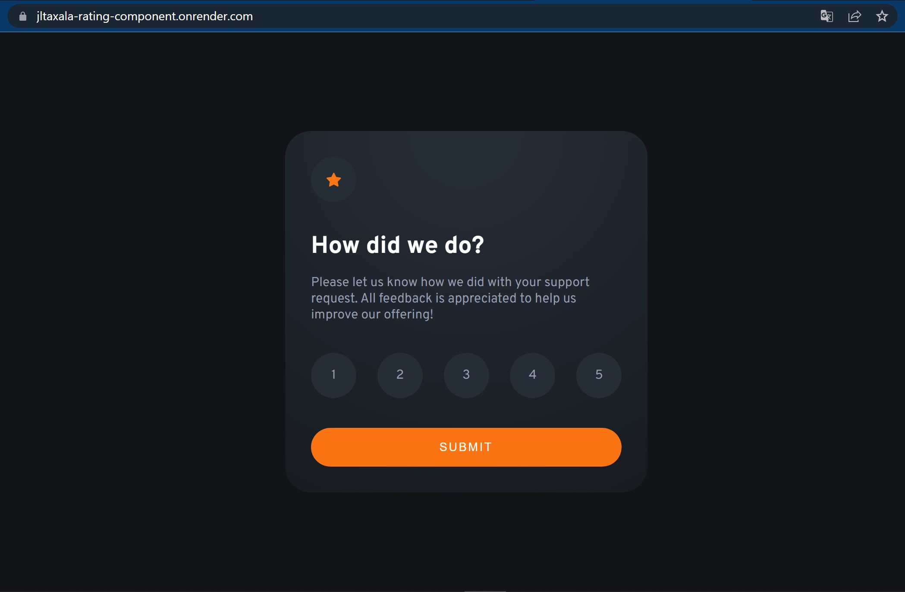
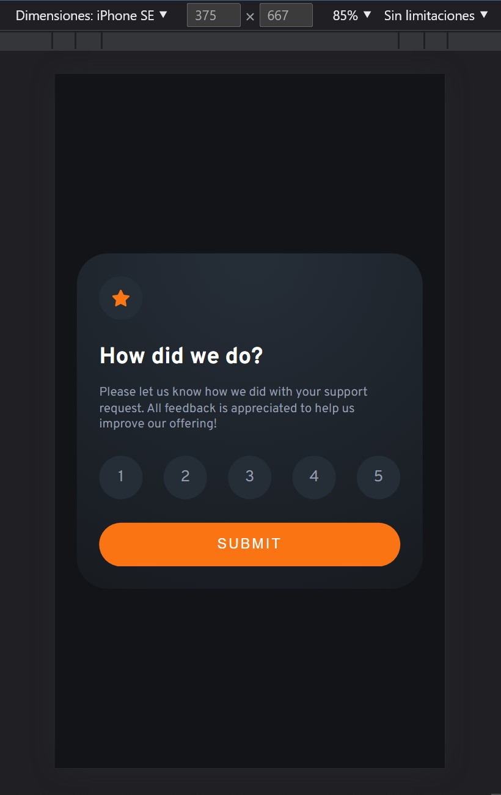

# Frontend Mentor - Interactive rating component solution

This is a solution to the [Interactive rating component challenge on Frontend Mentor](https://www.frontendmentor.io/challenges/interactive-rating-component-koxpeBUmI). Frontend Mentor challenges help you improve your coding skills by building realistic projects. 

## Table of contents

- [Frontend Mentor - Interactive rating component solution](#frontend-mentor---interactive-rating-component-solution)
  - [Table of contents](#table-of-contents)
  - [Overview](#overview)
    - [The challenge](#the-challenge)
    - [Screenshot](#screenshot)
    - [Links](#links)
  - [My process](#my-process)
    - [Built with](#built-with)
    - [What I learned](#what-i-learned)
    - [Useful resources](#useful-resources)
  - [Author](#author)
  - [😉 Than you for your time to review my code](#-than-you-for-your-time-to-review-my-code)

## Overview

### The challenge

Users should be able to:

- View the optimal layout for the app depending on their device's screen size
- See hover states for all interactive elements on the page
- Select and submit a number rating
- See the "Thank you" card state after submitting a rating

### Screenshot




### Links

- 📦 Solution URL: [Github repo](https://github.com/jtlaxcalaDev/Frontend-mentor-rating-card-with-react)
- 🚀 Live Site URL: [Render deploy](https://jltaxala-rating-component.onrender.com)

## My process

### Built with

- Semantic HTML5 markup
- CSS custom properties
- Flexbox
- Mobile-first workflow
- ⚛ [React](https://reactjs.org/) - JS library using (Tpescript)
- CSS media queries (screen sizes)
- React state hook
- React handleClicks
- [Vite](https://vitejs.dev/) - Frontend Tooling


**Note: These are just examples. Delete this note and replace the list above with your own choices**

### What I learned

✨ Media querias, css imports, css radial-gradient

```css
@import url('../../variables.css');

@media only screen and (max-width: 380px) {
  .rating--card, .results--card {
    font-size: 12px;
    padding: 1.8em;
    width: 290px;
  }
}

.rating--card {
  width: 360px;
  padding: 2rem;
  border-radius: 30px;
  background: radial-gradient(
    circle at top, 
    var(--dark-blue) 5%,
    var(--very-dark-blue) 140%
  );
} 
```

### Useful resources

- [Vite](https://vitejs.dev/) - Tool to create react apps (similar to Create React App) an build to static site more efficent to other tools
- [Render](https://render.com/) - Alternative to netlify or vercel use to deploy apps in miltiple languajes and frameworks

## Author

- 👨‍🚀 Frontend Mentor - [@jtlaxcalaDev](https://www.frontendmentor.io/profile/jtlaxcalaDev)

## 😉 Than you for your time to review my code 
